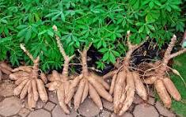

# Cassava Leaf Disease Classification: A Computer Vision Portfolio Project

.png)
*Collage of healthy cassava leaves*

## 🌱 Project Overview

Cassava is a vital crop for millions worldwide, but its yield is threatened by several devastating diseases. Early and accurate detection of these diseases is crucial for food security and farmer livelihoods. In this project, I leveraged state-of-the-art computer vision techniques to classify cassava leaf images and identify signs of disease infestation, combining both custom deep learning models and advanced transfer learning approaches.

---

## 🚀 Motivation

- **Real-World Impact:** Cassava diseases can cause up to 80% yield loss. Automating disease detection empowers farmers and agricultural stakeholders to take timely action.
- **Technical Challenge:** The project explores the nuances of image classification in a real-world, imbalanced, and noisy dataset, pushing the boundaries of both custom and pre-trained neural networks.

---

## 📦 Dataset

- **Source:** [Kaggle: Cassava Leaf Disease - Merged 2019/2020](https://www.kaggle.com/datasets/srg9000/cassava-plant-disease-merged-20192020)
- **Size:** 27,053 labeled images
- **Classes:**
  1. Cassava Bacterial Blight (CBB)
  2. Cassava Brown Streak Disease (CBSD)
  3. Cassava Green Mottle (CGM)
  4. Cassava Mosaic Disease (CMD)
  5. Healthy

---

## 🔍 Data Exploration & Preprocessing

- **Exploratory Data Analysis (EDA):**
  - Visualized class distribution (notably imbalanced).
  - Inspected image quality, size, and color channels.
  - Mapped numeric labels to disease names for interpretability.
- **Preprocessing Steps:**
  - Images resized to 224x224 pixels, converted to RGB.
  - Dataset organized into class-specific folders for PyTorch compatibility.
  - Performed dataset balancing via undersampling to address class imbalance.
  - Computed dataset mean and standard deviation for normalization.

---

## 🏗️ Custom Convolutional Neural Network (CNN)

- **Architecture Highlights:**
  - 3 convolutional blocks (Conv2d + ReLU + MaxPool)
  - Flattening, Dropout (to prevent overfitting)
  - Fully connected layers (500 units → 5 output classes)
- **Training:**
  - Loss: CrossEntropyLoss
  - Optimizer: Adam
  - Batch size: 32, 8 epochs
  - Achieved ~57% validation accuracy (limited by data complexity and model depth)
- **Key Learnings:**
  - Custom models offer flexibility but may struggle with complex, real-world data.
  - Imbalanced data and limited model capacity can hinder performance.

---

## 🔄 Transfer Learning with ResNet50

- **Why Transfer Learning?**
  - Pre-trained models like ResNet50 have learned rich feature representations from millions of images, making them ideal for challenging tasks with limited data.
- **Approach:**
  - Used PyTorch's ResNet50 as the backbone.
  - Replaced the final fully connected layer with a custom head (256 units + ReLU + Dropout + 5-class output).
  - Fine-tuned on the cassava dataset.
  - Implemented early stopping, learning rate scheduling, and checkpointing for robust training.
- **Results:**
  - Achieved ~63.5% validation accuracy (a significant improvement over the custom model)
  - Validation loss reduced to ~0.95
  - Training and validation curves showed better generalization and stability

---

## 📊 Results & Insights

- **Custom CNN:**
  - Validation Accuracy: ~57%
  - Struggled with minority classes and subtle disease features
- **ResNet50 Transfer Learning:**
  - Validation Accuracy: ~63.5%
  - Better at capturing complex patterns and generalizing to unseen data
- **Visualization:**
  - Plotted loss and accuracy curves to monitor training progress
  - Explored confusion matrices to identify misclassification patterns

---

## 🧠 Key Takeaways

- **Data Quality & Balance Matter:** Addressing class imbalance and ensuring high-quality images are critical for model success.
- **Transfer Learning Shines:** Leveraging pre-trained models can dramatically boost performance on challenging real-world datasets.
- **Iterative Experimentation:** Combining EDA, custom modeling, and transfer learning provides a holistic approach to problem-solving in computer vision.

---

## 🛠️ How to Reproduce

1. Clone this repository and set up the environment (see requirements in the notebooks).
2. Download the dataset from Kaggle and place it in the appropriate directory.
3. Run the notebooks in order:
   - `Data_Exploration.ipynb` (EDA & preprocessing)
   - `Classification.ipynb` (custom CNN)
   - `Transfer_learning.ipynb` (ResNet50 transfer learning)

---

## 🌟 Future Work

- Explore advanced data augmentation techniques to further boost accuracy.
- Experiment with other architectures (EfficientNet, DenseNet, Vision Transformers).
- Deploy the best model as a web/mobile app for real-time disease detection in the field.
- Collaborate with agricultural experts for field validation and impact assessment.

---

## 📬 Contact

**James Wachacha**  
[GitHub](https://github.com/Wachacha-jay)  
[Email](mailto:jameswachacha@gmail.com)

---

*This project demonstrates my ability to tackle real-world computer vision challenges, blending technical rigor with practical impact. Thank you for reading!*

*Cassava leaf sample from the dataset*

